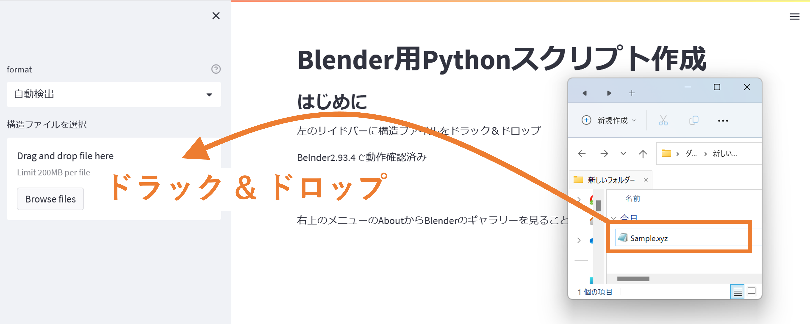
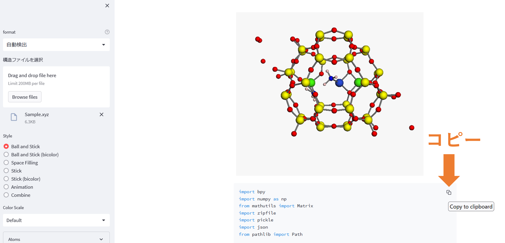
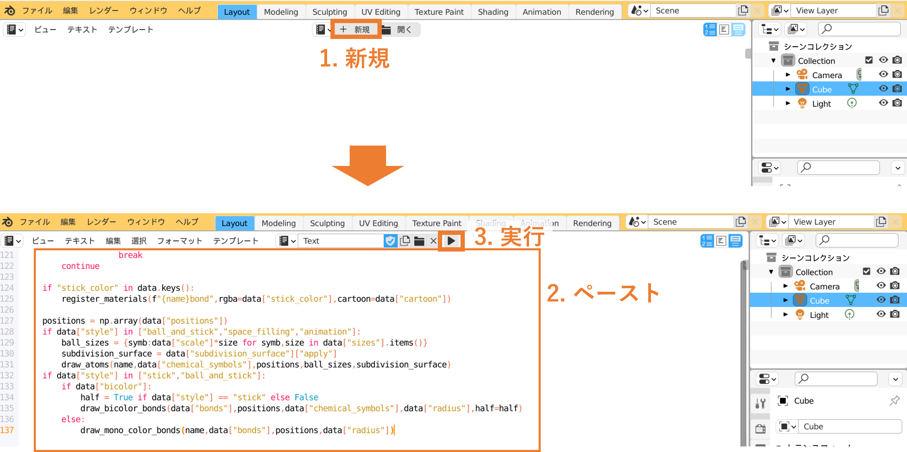
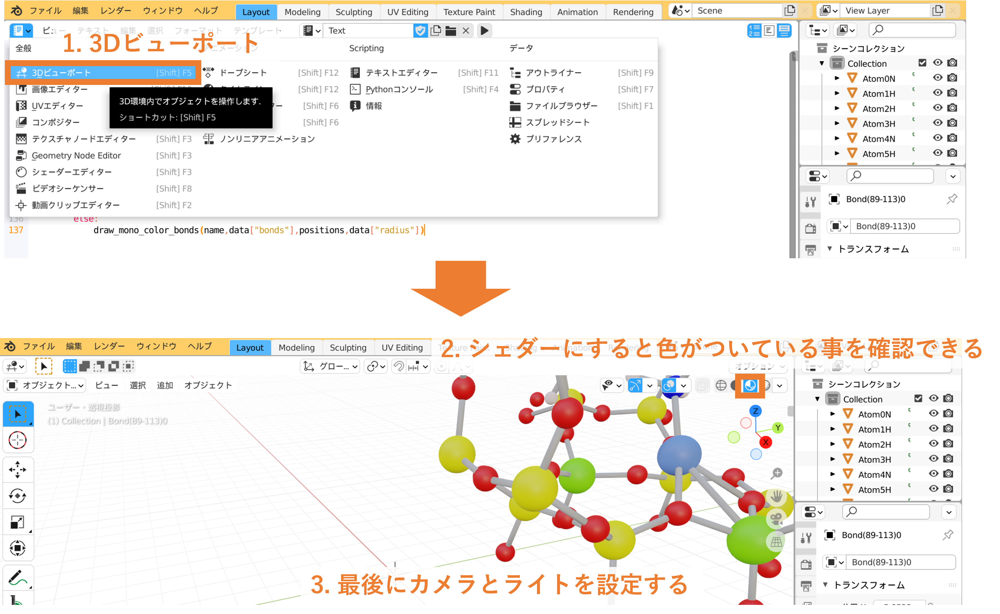

===================================================
化学構造をBlender上にインポートするためのWebアプリ
===================================================

`アプリはこちらから <https://shimi-lab-makeblenderscriptapp-app-vrendi.streamlit.app/>`_

使い方
=========
    
構造ファイルをドラッグ&ドロップ 

   
Pythonスクリプトをコピー

   
Blenderを開き,テキストエディターを開く

.. figure:: ./img/text_editor.png
   :width: 50%
   :align: center
   
新規をクリックし,コピーしたスクリプトを貼り付け,実行する

   
3Dビューポートに戻る.シェダーに切り替えると色がついていることを確認できる

   
カメラとライトを設定し,レンダリングする
