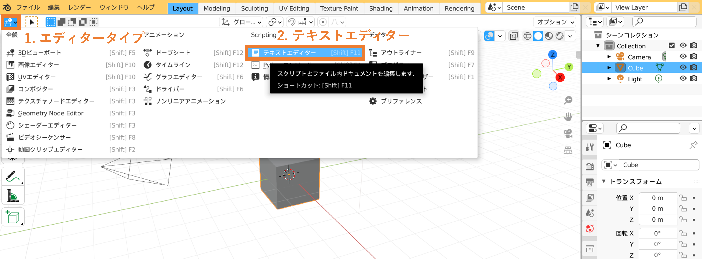

===================================================
化学構造をBlender上にインポートするためのWebアプリ
===================================================

`アプリはこちらから <https://shimi-lab-makeblenderscriptapp-app-vrendi.streamlit.app/>`_

基本的な使い方
=================
    
構造ファイルをドラッグ&ドロップ 

   
Pythonスクリプトをコピー

   
Blenderを開き,テキストエディターを開く

   
新規をクリックし,コピーしたスクリプトを貼り付け,実行する

   
3Dビューポートに戻る.シェダーに切り替えると色がついていることを確認できる

   
カメラとライトを設定し,レンダリングする

より詳細な使用方法については `ドキュメント <https://shimi-lab.github.io/mk-blender-scr_Document/>`_ を参照する.
